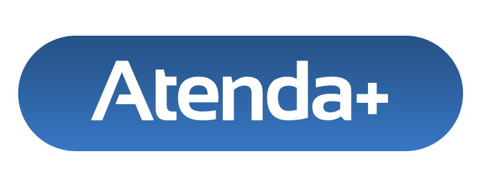
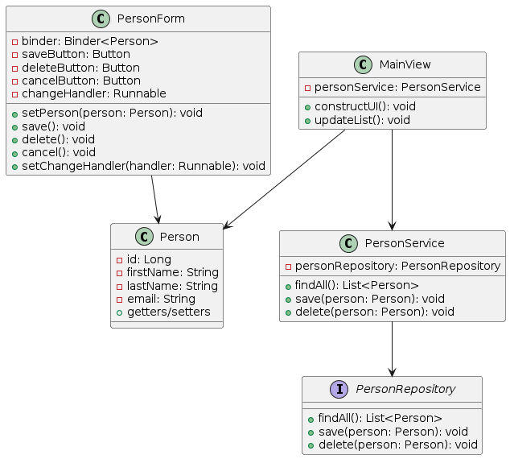

# Atenda+
Abrindo portas, sempre ao lado

## Descrição

Atenda+ é um projeto desenvolvido como parte da disciplina de Projetos 2 no curso de Gestão de Tecnologia da Informação na Cesar School. Este sistema permite que a coordenação de apoio psicopedagógico da instituição realize operações básicas de CRUD (Criar, Ler, Atualizar, Excluir) quanto ao atendimento do corpo estudantil, bem como a atualização da sua ficha de acompanhamento. 

## Fluxograma

  
  

[Ver o diagrama inteiro](http://www.plantuml.com/plantuml/png/jPDHImCn3CVVxrFaSJ8EtmyPSu8eJ94DVS_QR2lqsj7c9ZByxdeDZZ3heqyb_xJvvP_SpJDZug7tZV6OCpoX2s-Etk7K0BHme9HZM5CwEaCTlEYm0PY2YI5p6Wo_FawkEZX6Pui-72moBLtci_pP20Ea2WZ1sGwMCUnAi7KfypFsrC6QanCLF5P4wj5vfKnXHyoKydMMK_DKrw2DhUWGi-EOFiIRLahDhGlsrllHm-ZbHYxDIYxZaIPIv-Urde0bJrovK9l5VKmzI6ERRoAb3XRbLC2s01S3yrXEpb4MK2rXC1ZojSGUmuuUC5W_ebP32BZn9Aw8XVctDN5UyQebWMjfB7sdoPFzPGTgF2umfIqQ-hKOEFttQiu_GTlEBhvv7P7aBzghlMxKcfKwfs27tdy1)

## Executando a aplicação

O projeto é um projeto Maven padrão. Para executá-lo a partir da linha de comando,
digite `mvnw` (Windows) ou `./mvnw` (Mac & Linux), em seguida, abra
http://localhost:8080 em seu navegador.

Você também pode importar o projeto para sua IDE de escolha, assim como faria com qualquer
projeto Maven. Leia mais sobre [como importar projetos Vaadin para diferentes IDEs](https://vaadin.com/docs/latest/guide/step-by-step/importing) (Eclipse, IntelliJ IDEA, NetBeans e VS Code).

## Requisitos técnicos

[Clique aqui para conferir](docs/tech.pdf).

## Contribuições

Contribuições são bem-vindas! Se encontrar problemas ou tiver sugestões de melhoria, por favor, abra um problema neste repositório.

## Desenvolvedores

- mxs2@cesar.school
- vrln2@cesar.school
- jll@cesar.school
- cjam@cesar.school

## Licença

Este projeto está licenciado sob a Licença MIT - consulte o arquivo [LICENSE](LICENSE) para mais detalhes.